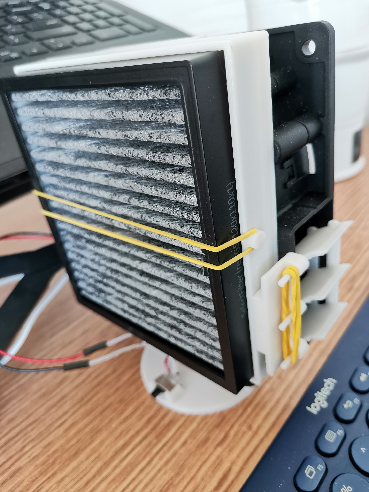
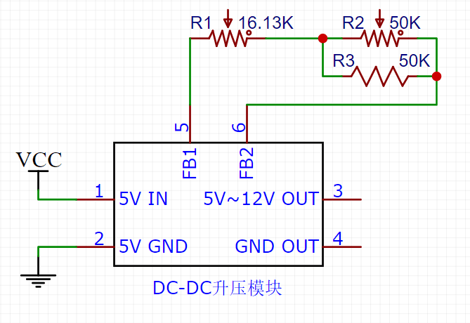
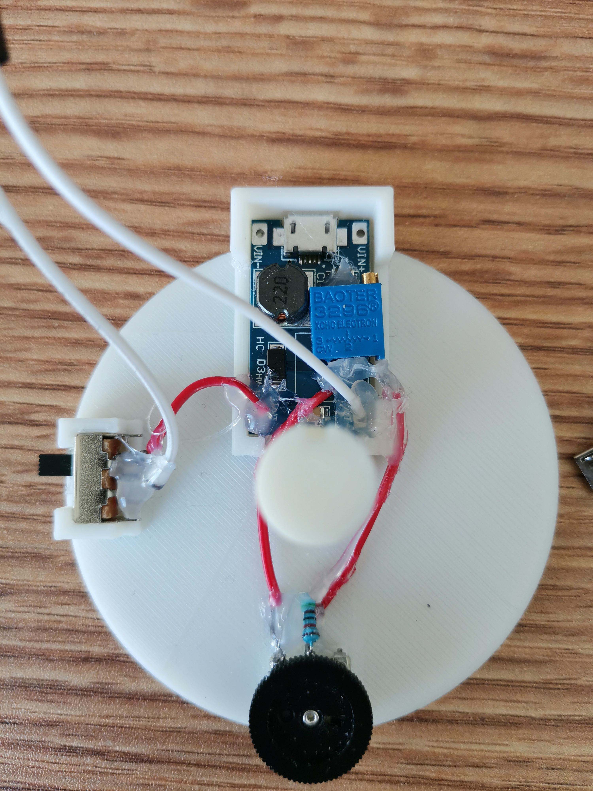

### 1. 介绍

本项目用于解决桌面个人空气净化问题，滤芯可以适配飞利浦原装车载空净滤芯，也可以用其他厂家的滤芯。

模型采用SketchUp制作

### 2. 准备
1. DC-DC升压模块

2. 50kΩ 拨盘齿轮电位器

3. 50kΩ 电阻

4. 50kΩ 3296W电位器

5. SNOWFAN 12CM 鼓风机（12V）

6. 拨动开关SS12d00G4
7. 橡皮筋一根、AD119胶水，接线若干
8. 尖形磨头，3D打印出来的模型不是很精确需要打磨。

### 3. 主板焊接

主板原理图：

1. 将DC-DC 升压模块上的 3296W电位器取下
2. 将拨盘齿轮电位器(R2) 和 电阻(R3) 并联
3. 然后再将齿轮电位器和 3296W电位器(R1) 串联
4. 再将新的电位器焊接上 DC-DC升压模块（注意！！！一定要焊接上才能通电测试，否则有可能烧坏升压芯片）
5. 电位器电阻越大，输出的电压越高，一般最高电压调到11V左右。
  

你的支持，是我不断贡献的动力！
